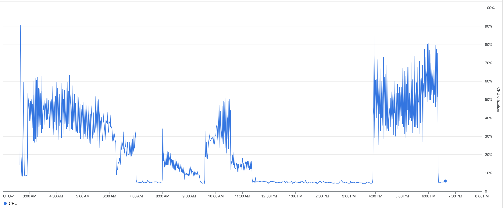

## Background 

This part of the project is to fullfill the E (extract) and L (load) of ELT of the NYC taxi data into Bigquery. Apache Spark clusters via GCP Dataproc are used for the efficient large data transfers. The DRY (dont repeat yourself) method is carried out here and is the foundational code to be used for spark implementation in Mage in the future.

## Setup

- full steps taken can be found in the [setup markdown](setup.md)

- permission configurations used can be found [here](../miscellaneous/supporting_docs/dataproc.md)

- files for local development

    + Dockerfile

    + requirements.txt

- files for loading data to BigQuery using Dataproc

    + extract-load-2-cloud-storage.py
    
    + helper+funcs.py

    + dict_query_helpers.py

    + extract-load-mapping-tables.sql

## 🚀 Observations 🚀

- for large data transfers, this method was favorable for the fluid transition from local development to cloud implementation.

- Google Dataproc  have already present VMs that are initiated once a cluster is setup and a job is triggered.

- loading data from parquets to BigQuery 
    
    + When considering a large scope of data (2009 to present), the dowloaded parquets had an immense variety of data types, column names and valid records. 
    
    + In this instance is where the `DRY` method came in handy. Instead of hypothesizing or sample testing the data types from some parquets, the parquet schema was instead derived once it was loaded as an external table in BigQuery

    + the `bucket_2_bigquery()` function in [helper_funcs.py](helper_funcs.py) per parquet load, compares schemas of the external table loaded versus that of the latest table in BigQuery. If the schemas are the same the new data is simply inserted into the latest table, else a new table is created.

## 🚀 Findings 🚀

### Data loaded to BigQuery

| TRIP TYPE | ROW COUNT | SIZE GB
----------|-----------|--------
| yellow| 17,782,38,040 | 413.56
| green| 83,484,688 | 19.41
| fhv| 769,699,561 | 103.73
| fhvhv| 1,236,913,338 | 315.12

### Dataproc performance 

- to keep the cluster setup simple and make it easier to log what queries were executed for which parquet load, each trip type was executed one at a time: yellow --> green --> fhv --> fhvhv

- screen shot graph from job monitoring can be found [here](../images/1_extract_load_dataproc/)

    + yellow: 3am-7am

    + green: 8am-9am

    + fhv: 9:45am-11:30am

    + fhvhv: 4pm-6:30pm

- when looking at CPU % utilization, disk performance and network activity, the yellow and fhvhv trip data consumed the majority of the cluster's resources 

- based on the general CPU consumtion of each of the trips, it is recommended in the future that if they were to be run parallel to have them run in completely different clusters or a cluster with more workers and greater memory.