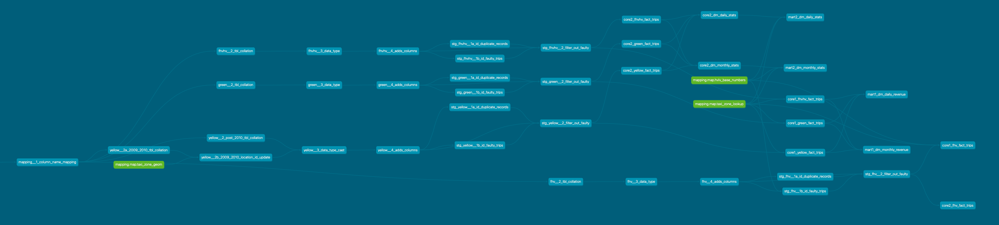

## Background

This part of the project is to fullfill the Transformation (T) of ELT of the NYC taxi data into Bigquery. `Data Build Tool (DBT)` was emplyed for this. This was done to explore the advantages of the tool, enabling data modeling, DAG orchestration and testing using a python/jinja framework. 

## Setup

- development was carried out exclusively in a docker container to verify development would not come across package version conflicts.

- for working with docker, `devcontainer` extension in `VS Code` was employed, details on how this was carried out can be found in [setup](setup.md)

## Transformation Overview

- The 4 step/layer approach was taken here 

    + **clean**: The goal here was to collate all 67 original tables from `nytaxi_raw` schema to 4 trip type tables. This was done updating entries and adjusting them accordingly if they were historically reported differently and updating data type accordingly. This possible via custom [macros](macros), `update_*`. At the conclusion of this layer, the tables were materialized in `nytaxi_clean` schema.

    + **stage**: The goal of this layer was to identify potential faulty records and filter them out of the pipeline. This was done in 2-stage approach via views in [stage](models/stage): `__1a_id_duplicate_records` and `__1b_id_faulty_trips`. At the conclusion of this layer, the views were stored in `nytaxi_stage` schema.

    + **core**: The goal of this layer was to create, as it is termed in industry, "single source of truth". The views in stage (which filters out faulty records) are materialized into `_fact_trips` tables here. At the conclusion of this layer the tables were materialized in `nytaxi_core` schema.

    + **mart**: The goal of this layer is to calculate metrics to dimension tables: `dm_daily_stats` and `dm_monthly_stats`, with all the trip types together. At the conclusion of this layer, the tables were materialized in `nytaxi_mart` schema. 

- Two types of transformations were applied 
    
    + core1/mart1: this approach is where the terms/dimensions that were represented in the original raw data as codes/IDs (location_id, ratecode, payment_type etc.) were translated to end-user friendly terms right at the core transformation layer. It is hypothesized that this will be more compultationally expensive since record changes occur at the entity layer. 

    + core2/mart2: this approach is where the terms/dimensions that were represented in the original raw data as codes/IDs (location_id, ratecode, payment_type etc.) were translated to end-user friendly terms **after** metrics were calculated in mart layer. It is hypothesized that this approach will be more efficient as there are less records will experience changes. It is also hypothesized that this approach is more practical since the entities are probably not of interest to the end-user, therefor only applying computationally expensive changes where needed. 

**DAG plan DBT compiled solely based on the model dependencies**



## Performance testing 

This was carried out using envrionment cleanup macros and `dbt build` commands.

**Full details can be found in**:  👉👉👉👉👉👉👉👉👉👉 [testing_protocol](testing_protocol.md)

## 🚀 Highlights 🚀

1. Made testing/development easier

    + variation of data volume test and methods were made possible by enabling/disabling cetrain models via `+enabled` parameter in `dbt_project.yml`

    + custom creating macros to cleanup BigQuery environment:

        - [copy_clone_raw_tables](macros/copy_clone_raw_tables.sql): with `dbt run-operation`, it was possible to recreate `nytaxi_raw` and/or add more tables to it from the backup schema for each incremental load in testing. Without this macro, all 67 tables would have had to been cloned/dropped manually for each testing phase.
        
        - [clean_bigquery_env](macros/clean_bigqeury_env.sql): with `dbt run-operation`, it was possible to compare what resources were present in BigQuery vs what was modelled in DBT. Any resources that were no longer modelled in DBT for development reasons were dropped. Without this macro, it would of been a very manual process to compare the 2 systems and adjust accordingly. 

2. `DRY` (dont repeat yourself) coding 

    + again this is where macros came in handy. 
    
    + Syntax for case statement for transforming records were used multiple times across the different models. It was possible to create each type of case statement 1x via a macro and implement them across model however many times as needed.

    + also, it was easier to make the case statements more generic to capture edge cases from all trip types 👉👉👉 DRY

    + they are the `update_*` and `get_*` macros which can be found [here](macros)

3. jinja incorporation made pipeline compilation seamless 

    + the `{{ ref() }}` and `{{ source() }}` jija syntax indicated to DBT the pipeline dependencies. With this, DBT was able to orchestrate the DAGs correctly independently, relieving the user of another configuration to manage during development. 

    + historically this configuration is done manually with any given orchestrator (airflow, step functions etc). When a data model grows larger and is under going extensive development and testing, this task can become incredibly tedious and very error prone.

    + With DBT + jinja taking care of this under the hood, more time is invested in data model development and no errors arise due to transformation dependency issues.

4. testing and constraints 

    + testing in DBT is a powerful capability. There a wide range of tests that can be applied (out of the box or customized), how the results can impact that transformatin pipeline (error or warn) and it acting as a type of QA to help the user improve the data model. 

    + like in pt.3, their dags are also facilitated by DBT under the hood, so no manual orchestration coordination is necessary

    + a really beneficial feature is constraints in the `schema.yml` of each file. In the schema, each model can be defined with a description, the dimensions (description and respective data types). When implementing the syntax:

        ```
        config:
            contract:
                enforced: true
        ```

    + data types define in the schema must be true in the target database (BigQuery in this case) as well. Should these "contract" not be true, the model compilation fails. This may seem quite tedious at first, but data contracts and restrictions lead to better documnentation, data governance and data qualtity

    + record count and data volume change throughout transformation 

        | TRIP TYPE | SCHEMA | RECORD COUNT | SIZE GB
        ------------|--------|--------------|--------
        | yellow | nytaxi_raw | 17,78,238,040 | 413.56
        | yellow | nytaxi_clean| 1,769,302,200 | 531.63
        | yellow | nytaxi_core2| 1,720,483,494 | 562.83
        | green | nytaxi_raw | 83,484,688 | 20.08
        | green | nytaxi_clean | 83,484,688 | 24.32
        | green | nytaxi_core2 | 82,679,980 | 26.22
        | fhv | nytaxi_raw | 769,699,561 | 109.89
        | fhv | nytaxi_clean | 769,699,561 | 157.99
        | fhv | nytaxi_core2 | 354,941,330 | 84.40
        | fhvhv | nytaxi_raw | 1,236,913,338 | 325.02
        | fhvhv | nytaxi_clean | 1,236,913,338 | 405.41
        | fhvhv | nytaxi_core2 | 301,023,847 | 103.31

5. documnetation compilation 

    + with successful model compilation and `schema.yml`, rendering project documentation is quite easy and well formated. This is beneficial in collaborative work where other end users will then use the data model for further data interrogations, reporting etc. 

6. hooks

    + dbt permits for additional sql/python commands to be executed apart from those defined in `models`

    + this is most beneficial when needing to apply grants to different roles after a table is created/re-created

    + for this project, post run hook ([dbt_project.yml](dbt_project.yml) at lines 97-98) was employed to collect query history info on the queries run for later analysis. Macro triggered by the post hook can be found [here](macros/get_query_history.sql)

    + this can be executed via post hooks (after each model compilation or at the end of each run). DBT documentation is quite extensive on what these hooks can do and what can be implemented in them.

## 🫣 🫠 Limitations 😵‍💫 🤐

* I would say the greatest short coming I see at the moment is mostly in how dbt builds the models and incremental loading configurations 

* DBT by default always `create or replace` tables as opposed to `create` + `insert into`. From working with DWH developers, the best practice is to create tables with specific column names and fized data types (as opposed to create as select) and when doing delta/incremental loading, to do truncate/delete from then insert new records. Looking semi extensively into the documentation, the `delete+insert` incremental method is only available out of the box in other datawarehouses like snowflake, but not for BigQuery.

* There is the possibility to customize incremental method, but that is more for advanced users. This can be a goal for future projects 😎