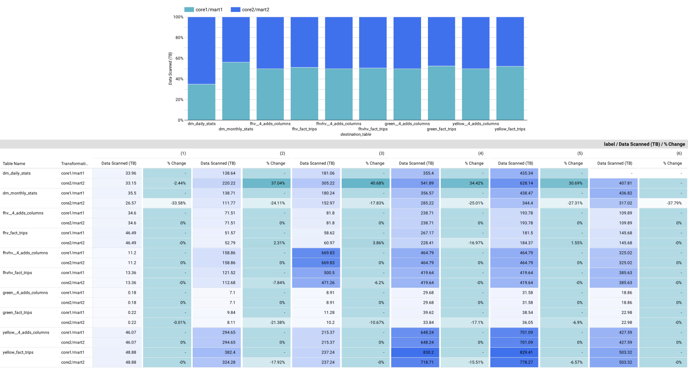

## Background 

Concluding running 2 modeling transformations using [DBT](../../2_transformation_dbt), saved info from BigQuery's query history view was analyzed to evaluate performance and hypothesis previously outlined: **translating raw data identifiers is more efficient after metric aggregations are calculated as opposed at the the entity level prior to metric calculations**.

## 🚀 Analysis 🚀

Query history info, stored in `query_history_extract_load_transform_project`, was used to create temporary tables in BigQuery session and then run select queries to evaluate:

- Transformation performance at a high level vs by model 

- performance on compiling fact and dimension tables 

- derive root cause of slot contention

- slot performance across transformation methods

Queries for analysis can be found in this [sql file](queries.sql) and accompanying figures can be found [here](../../images/3_insights/performance_testing). Inspiration of analysis topics are based on BigQuery documnetation, notes on this can be found [here](../../miscellaneous/supporting_docs/bigquery.md) under `Notes on query performance`. 

## 🧐 Observations 🧐

### Good to knows

- query stats for [mart1_dm_daily_revenue](../../2_transformation_dbt/models/mart1/mart1_dm_daily_revenue.sql) are missing due to a failed run of this table during the full refresh. This was due to the same being partitioned by day, which resulted in more than 4k partitions. It was changed to monthly partition, but the model was never re-run.

- in the graphs often refer to `Run #` signify the run number found in `run_tag` in [tesing_protocol](../../2_transformation_dbt/testing_protocol.md).

- for run time stats, they are fetched from `query_history_extract_load_transform_project` in the `job_stages` json. Diff ms refers to calculating the millisecond (ms) difference in max and average of wait/compute/write/read of the workers for all the stages in a given job.  

- For analysis, models with the substring `revenue` where changed to `stats` and `core1/mart1/core2/mart2` were changed to have the number removed. This was to better aggregate the comparison stats for more straight forward analysis. The source of the models were still indicated under the dimension `transformation type` throughout the figures

### How did the transformations perform? Was the hypothesis correct?

When looking at runtime and scanned data at incremental vs full refresh between the 2 transformations, at first instance the 2 transformations performed the same, with core2/mart2 transformation slightly running longer and scanning smidge more data on data intensive incremental loads. 

Comparing transformation stats at the table level revealed that core2/mart2 in fact reduced runtime and data scan by as much as `38%`, most notably in `dm_monthly_stats`, `yellow_fact_trips` and `green_fact_trips`. What is a little puzzling though is the performance of `dm_daily_stats`, it seemed to have longer runtimes and data scans for core2/mart2 incremental transformations. 

Aggregation and identifier transformation occured in different ways: 

- core1/mart1: executed via the [fact table](../../2_transformation_dbt/models/core1) and [dm table](../../2_transformation_dbt/models/mart1)

- core2/mart2: executed via 2 step dm table transformation, [core2_dm_daily_stats](../../2_transformation_dbt/models/core2/core2_dm_daily_stats.sql) and [mart2_dm_daily_stats](../../2_transformation_dbt/models/mart2/mart2_dm_daily_stats.sql)

When looking comparing the **GB** size of scan data in the chart below, the aggregation performance in the core2/mart2 transformation (check row where schema name is core for core2/mart2 transformation) is actually more efficient in core2/mart2 compared to core1/mart1 transformation. What caused the 30-40% increase in performance for `dm_daily_stat` in core2/mart2 transformation was indeed the reformating of identifiers (like rate code, payment type etc). 

### BigQuery's query performance insights indicated some slot contention occured, can this be explained?

Slot contention, as defined by BigQuery documentation, **occurs when your query has many tasks ready to start executing, but BigQuery can't get enough available slots to execute them**.

Query performance insights flagged this when creating and updating model `fhvhv__4_adds_columns` in both transformation methods. No surprise it was flagged in both transformation methods since the syntax is unchanged. The particular job stages this was flagged was in `Join+` and `Sort+`, for runs `core1/mart1 - incremental - (4) - datasource` and `core1/mart1 - full refresh - (6) - datasource`. In the figure below when comparing diff ms (difference between max and avg ms the given category of slots), wait time and compute time showed the most significant time (ms) compared to the other quantified categores (read and write time stats). 

Some observations to note that contributed to this:

- slot contention for Sort+ can be remidied by removing the `order by` in the `row_number()` function used in [fhvhv__4_adds_columns](../../2_transformation_dbt/models/clean/fhvhv/fhvhv__4_adds_columns.sql) model. This function is used to help create unique identifier for the `trip_id` dimension, where more than 1 record have more the same exact stat recording. This duplication is hypothesized to be attributed to coincidense (where 2 independent passengers happen to order the same trip but just from 2 different drivers from their apps). The function can still have the same effect without the order by.

- the Join+ slot contention is a little more difficult to explain, espcially during the 4th run, given that no new fhvhv trip data was loaded during that incremental test (check [test_protocol](../../2_transformation_dbt/testing_protocol.md) for background, also this was confirmed in the first temporray table in [sql queries](queries.sql)). Based on the charts right above, the Join+ was more impacted by wait ms as opposed to compute ms, there was also no read and write ms stats given there was no data for that incremental run. What **can** possibly explain this though is the number of tables for the other trip types that were loaded for run 4 and 6, which were 21 and 67 tables respectively. These 2 runs saw the largest number of table loads compared to the other runs. So, even though there was no fhvhv data that could of caused slot contention, the number of tables to scan and data volume of the **other** trip type data may have cause the contention. 

### What can run time stats reveal about query performance?

Here the goal is to determine if there is a relationship between data scanned and slot time fluctuations. To examine this, the average wait ms and compute ms difference (max - avg) in all models in [core1](../../2_transformation_dbt/models/core1), [mart1](../../2_transformation_dbt/models/mart1), [core2](../../2_transformation_dbt/models/core2) and [mart2](../../2_transformation_dbt/models/mart2) were calculated and compared to total bytes billed per incremental and full refresh. 

The described comparison are visualized in graphs that can be found [here](../../images/3_insights/performance_testing/impact_incremental_data_volume_has_on_wait_and_conpute_ms). In general, the fluctuation in bytes billed vs wait and compute difference in general follow the same trends, with compute difference ms showing more pronounced fluctuation. With this similarity in fluctuation pattern throughout the runs, it indicates that the difference in max and average ms of slot/worker performance is mostly due to the data volume processed in the specific run. Of course to better confirm this, it would be best to run the pipelines multiple times and evaluate. 

## ✨✨ Takeaways ✨✨

- Based on the analysis above, it is concluded that **translating raw data identifiers is more efficient after metric aggregations are calculated** is a more efficient approach. 

    + the performance of core_dm_daily_stats/mart_dm_daily_stats in core2/mart2 approach did prove to be expensive though. In this case a compromise can be to leave core_dm_daily_stats as is but for mart_dm_daily_stats, to perhaps perform it only for the latest month or quarter of data. Since end users most of the time are interested in the latest data, perhaps it is sufficient to run the full transformation on the latest data only and for more historical data have the transformation saved as a view for it to be called by any given BI tool. 

- there is always room for further optimization and finetuning in data modeling, as seen by the case of `order by` probably leading to slot contention, as mentioned above. 

    + updates for improvement comes mostly from multi iterations of feedback loops with BI end users based on their latest needs

    + another possibility to look into the future is to see if a `delete+insert` incremental load as a opposed to a `merge` load would be more efficient, this can be concluded post testing and analysis 

- the average difference in max vs avg wait and compute ms in the end were a maximum of 5k ms, which is about 5 seconds in the end. That is not a significant difference, but this was only based on 850 GB of data which is quite a small volume compared to TB and PB of data volumes that are typically seen in industry. At a larger scale, it is good to conduct these type of analysis as a sense check to see where the model can be updated for efficiency and cost savings

- `DBT` and `BigQuery's query history` are invaluable instruments to use for model development and testing. DBT faciliates DAG orchestration and reinforces good data contract and testing protocols, while the query history offers extensive information on helping end users understand the impact of the run jobs for future development and better improvements. 