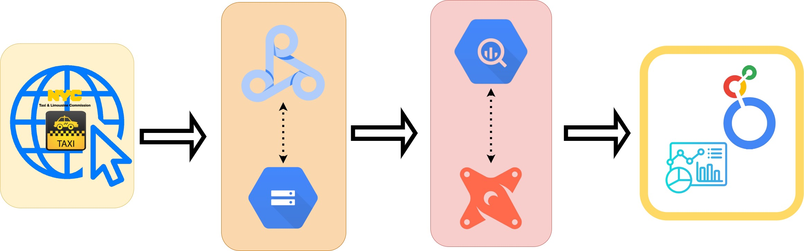

## Background

This project was created to explore ELT methods and optimizations within the data processing approach using tools: [Dataproc](https://cloud.google.com/dataproc?hl=en), [PySpark](https://spark.apache.org/docs/latest/api/python/index.html), [DBT](https://www.getdbt.com/) and [BigQuery](https://cloud.google.com/bigquery/docs/introduction). Inspiration is based on lessons learned from DataTalks Club [dataengineering zoomcamp](https://github.com/DataTalksClub/data-engineering-zoomcamp). The [nyc taxi dataset](https://www.nyc.gov/site/tlc/about/tlc-trip-record-data.page) was used for development for its volume and easy accessibility. 

## Project Overview 

## ✨✨ Highlights ✨✨

### Extract-Load

- Able to load all `2009-2024` trip data (**850 GB** 😱) to BigQuery using [GCPs Dataproc Hadoop/Spark Clusters](https://cloud.google.com/dataproc?hl=en), in `DRY` code method. 

- All 4 trip types (`yellow`, `green`, `fhv`, `fhvhv`) were loaded using the same script, where only the input parameters for the `PySpark` script differentiated for each trip. There was also no need to pre-configure custom DDL statements for they were derived from the external/stage tables per parquet instead.

**Want to find out more? Checkout details here** 👉👉👉👉👉👉👉👉👉👉 [1_extract_load_dataproc](1_extract_load_dataproc)

### Transformation

- Benefits of using `DBT`: 

    + `DRY` coding in models with the help of `macros`

    + `dbt tests` and `data contracts/constraints` were instrumental in model development for improving data contracts, optimizing primary key creation and filtering out faulty data where detected 

    + `jinja`,  `post-run hooks` and `dbt run-operation macros` helped a great deal in collecting query performance stats and facilitating incremental testing for model method comparison

**Want to find out more? Checkout details here** 👉👉👉👉👉👉👉👉👉👉 [2_transformation_dbt](2_transformation_dbt)

### Insights 

#### Performance analysis 

- `DBT's` out of the box framework, plethora of community resources and BigQuery's rich query history stats enabled for a deep dive for model performance analysis 

- The analysis confirmed that **translating raw data identifiers is more efficient after metric aggregations are calculated**

- the analysis also revealed some current limitations in the better transformation approach that led to some slot contention, but with proposals for even better improvement and lessons learned for the future

**Want to find out more? Checkout details here** 👉👉👉👉👉👉👉👉👉👉 [3_insights/performance_testing](3_insights/performance_testing)